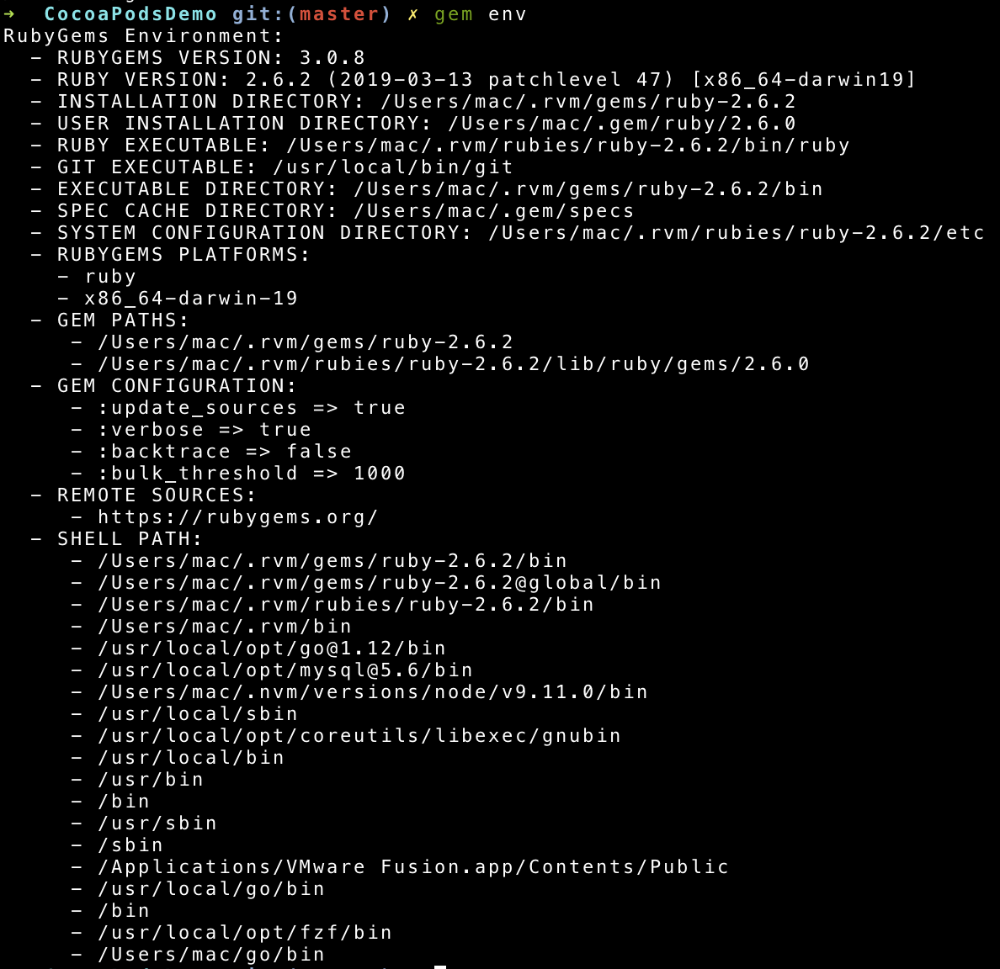
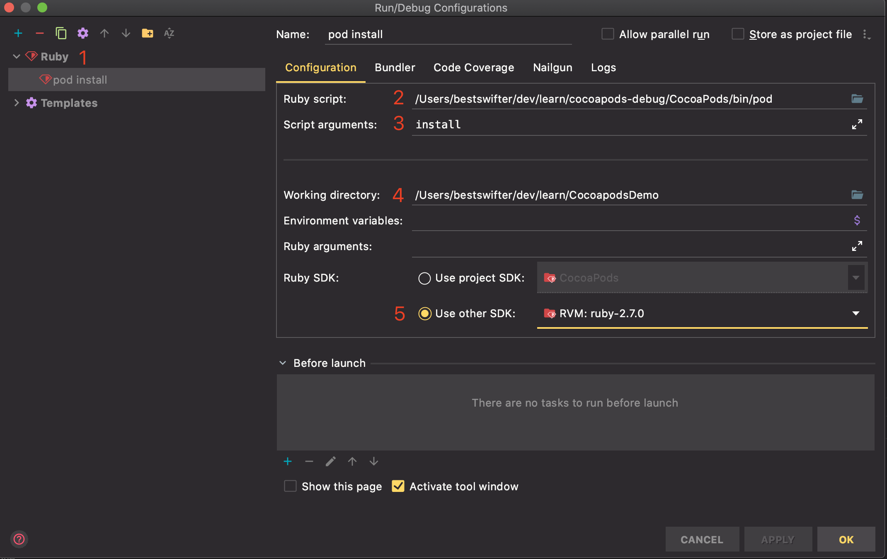
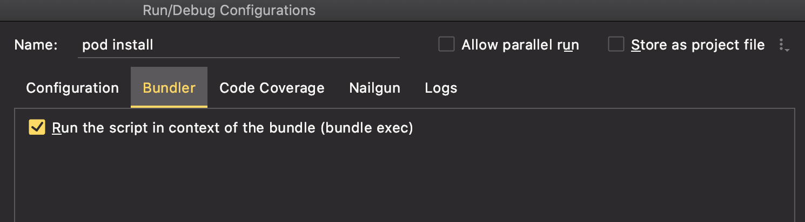
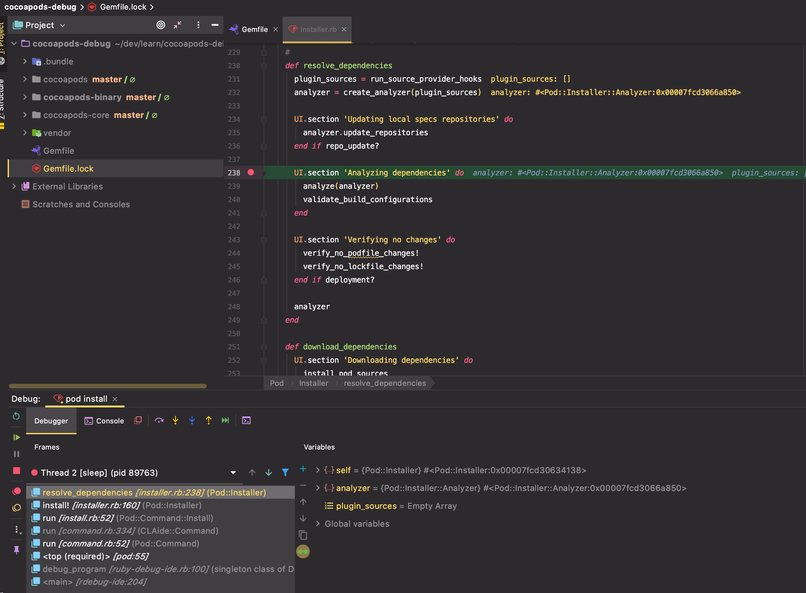
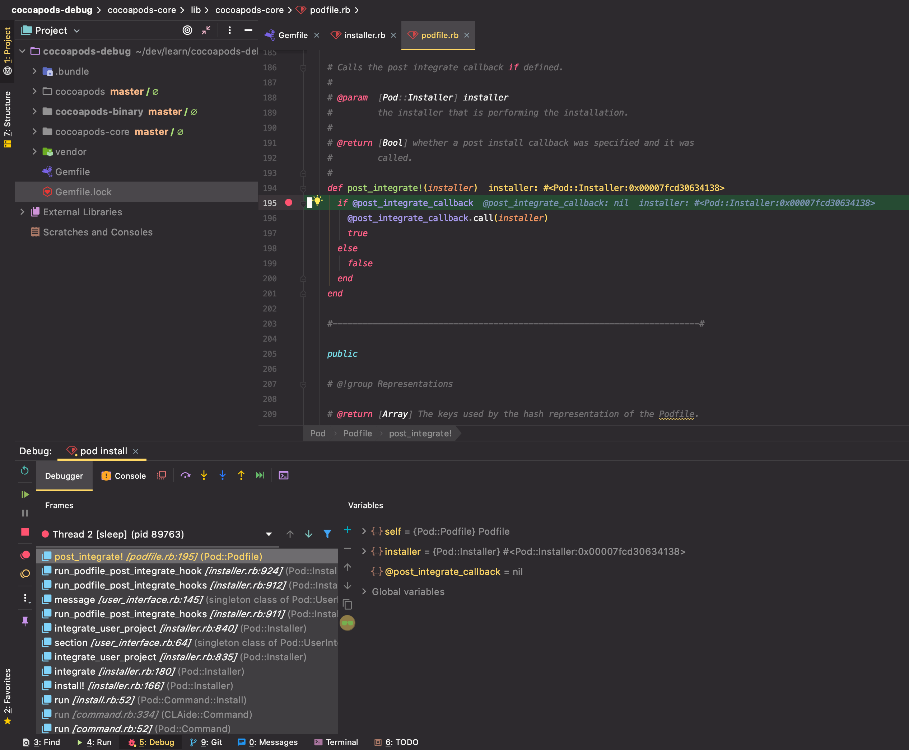
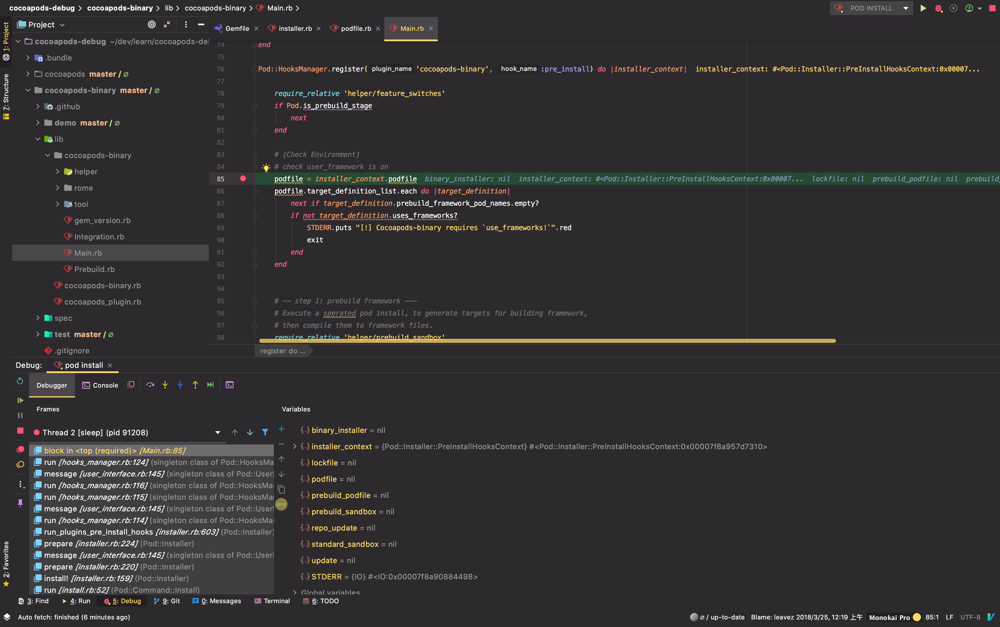

# Cocoapods 源码调试

## 综述

对于任何大型工程来说，硬着头皮直接看源码，往往不是最高效的选择。如果能直接从源码运行起来，并且打上断点，可以说就已经解决 80% 的问题了。
因为函数间的调用关系已经不再是瓶颈，最多就是有一些语法上的规则不了解，可能会影响阅读了。

在开始调试之前，也参考了一些网上的资料：

- [使用 VSCode debug CocoaPods 源码和插件](https://github.com/X140Yu/debug_cocoapods_plugins_in_vscode/blob/master/duwo.md)：我司大佬同事写的文章，但是我个人还是不太喜欢用 VSCode。
  尤其是这类脚本语言，JetBrains 家的 IDE 总感觉更加专业一些。而且插件的调试流程不太自然，过于 hack 了。
- [Cocoapods 插件调试环境配置](http://dreamtracer.top/cocoapods-cha-jian-diao-shi-huan-jing-pei-zhi/)：和这个类似的还有几篇文章，但基本上大同小异，我没有成功跑起来，里面的逻辑也感觉比较奇怪。

本文主要介绍，如何**基于 RubyMine** 这个 IDE，创建一个**隔离的环境**，来调试 Cocoapods 和相关的插件。

## 背景知识介绍

在折腾源码调试之前，我对 Ruby 的工具链并不熟悉（现在也是一只半解）。但是这部分知识的确实，会比较影响后续排查问题，以及对整体流程的理解。所以有必要提前解释下。

我会尽量从基础到实际，用简单的语言来描述下相关工具的作用。不少概念参考自御姐的文章：[为什么我们要使用 RVM / Bundler ？](https://juejin.im/post/5c1fb3696fb9a049af6d4132)

### RVM

rvm 的全程是 `ruby version manager`，用来在命令行下，提供多 Ruby 版本的管理和切换能力。它不仅可以管理多个 ruby 版本， 也可以用来替换系统自带的 Ruby。那个 Ruby 配置有很多问题，比如最典型的，
`gem install` 安装依赖报错，没有权限。

安装：

```bash
# 可能需要用 gpg 命令先进行验证，根据命令行提示来操作一般都没问题
curl -sSL https://get.rvm.io | bash
```

使用 `2.6.2` 版本的 ruby

```bash
rvm install '2.6.2'
rvm use 2.6.2
```

### gem

这是 Ruby 的包管理工具，类似于 iOS `cocoapods`，JS 的 `npm`，macOS 的 `homebrew`

当我们使用 rvm 来管理 ruby 版本后，和 `ruby` 命令一样，`gem` 命令也不再是系统自带的，而是由 `rvm` 统一提供了。

以通过 rvm 安装的 ruby 2.6.2 为例，这个可执行的 `gem` 二进制，位于目录 `$HOME/.rvm/rubies/ruby-2.6.2/bin/gem` 下

可以通过 `gem env` 命令来查看更详细的配置：



如果需要安装 Ruby 的包，可以通过下面命令：

```bash
gem install bundler
```

大部分 gem 包的安装路径都在上图中的第二个路径，即 `$HOME/.rvm/rubies/ruby-2.6.2/lib/ruby/gems/2.6.0` 下。也有少数被安装在第一个路径 `$HEOME/.rvm/gems/ruby-2.6.2` 下。不过都不影响使用（有了解的同学可以指教一下这俩路径的区别）。

### bundler

这是一个特殊的 gem 包，安装后会得到一个叫做 `bundle` 的可执行文件。主要是用来管理所有 `gem` 包的版本的。

举个例子，如果没有 `bundler` 这个包，每个项目都需要手动执行多个 `gem install` 命令。由于语义化版本号的范围依赖问题，不同时候执行 `gem install` 命令得到的结果可能是不一样的（比如开发者又发布了更新的版本，默认就用上了）。

`bundler` 的解决方案是，它定义了一个 `Gemfile` 文件，用来描述一个项目所有的 `gem` 包依赖情况。

然后通过 `bundle install` 命令一件安装，并且生成 `Gemfile.lock` 文件来锁定版本号。由于本文的读者至少是对 Cocoapods 有一定了解的开发者，这个文件和机制的作用，就不需要再解释了。

`bundler` 还提供了 `bundle exec` 命令，来确保依赖的准确性。

上文介绍了，默认情况下 `gem install` 安装的 `gem` 包，都会存储到一个全局统一的路径下。如果我们安装了同一个 `gem` 包的不同版本， `bundle exec` 命令就可以根据 Gemfile 中的依赖，自动选择正确版本的 `gem` 包了。

> 对于新人来说，bundler 这个库确实比较怪，一句话总结就是：安装了 `bundler` 这个包后，可以用 `bundle install` 命令来读取 `Gemfile` 文件中定义的 `gem` 包依赖，自动批量安装，并且生成 `Gemfile.lock` 文件锁定版本号

## 源码调试

### 原理

经过一番摸(cai)索(keng)，我整理了一下使用 RubyMine 调试的原理。由于都是经验性的结论，就不上分析过程了。

要想调试 `pod install` 等命令的流程，我们至少需要两个目录：

- 源码目录：这里面要存放 cocoapods 的源码，如果要调试插件，插件的源码也要在这里。
- iOS Demo 工程目录：这里面要有 Demo 工程和用于测试的 Podfile，并且使用上面源码版本的 Pod

对于 RubyMine 这个 IDE 来说，它的调试依赖于 `ruby-debug-ide` 这个 IDE，并且需要进入到 Demo 工程目录去执行源码版本的 Pod。

理解这个原理非常重要，因为它看起来会带来一些矛盾：

- 我们日常需要基于源码目录进行开发， 查看函数的定义，写代码等等。Gemfile 也需要在这个工程下配置，这样才能源码依赖和调试插件。
- Demo 工程理论上应该和源码目录完全解耦，因为一份源码工程完全可以对应多个 Demo 工程，不能叫接收两者耦合
- 实际的 `Pod Install` 是发生在 Demo 工程目录下的，需要在这里引用到 Cocoapods 源码，并且正确的配置相关依赖

上述三个需求是预期达到的目的，再基于之前的原理分析，初步可以形成一个思路：“主体配置放在源码目录中进行日常开发和管理，Demo 工程中通过软连接的方式获取到 Gemfile 配置”。

下面分别介绍 Cocoapods 源码目录和 Demo 工程目录的配置。

### Cocoapods 源码目录配置

首先创建一个空的目录，然后把我们要调试的代码下载下来：

```bash
git clone https://github.com/CocoaPods/CocoaPods.git cocoapods
git clone https://github.com/CocoaPods/Core.git cocoapods-core
git clone https://github.com/leavez/cocoapods-binary.git
```

这里把 cocoapods-core 模块也以源码的方式引入，原因有两个：

1. cocoapods 工程是由若干个子模块共同组合的，尝试一下 cocoapods-core 这个子模块的调试体验
2. 目前(2020.7) 最新的 cocoapods 仓库中，依赖于 cocoapods-core 模块提供的 `post_integrate` 钩子函数。但是 这个函数的实现，还在 cocoapods-core 的 master 分支上，并没有跟随最新的版本(1.9.3) 发布。而 cocoapods 默认是通过版本号来依赖 cocoapods-core 模块的，所以需要手动改为源码依赖。

然后创建一个 Gemfile，内容如下：

```ruby
dir = File.dirname(Pathname.new(__FILE__).realpath)

gem 'cocoapods', path: "#{dir}/cocoapods"
gem 'cocoapods-core', path: "#{dir}/cocoapods-core"
gem 'cocoapods-binary', path: "#{dir}/cocoapods-binary"

group :debug do
  gem 'debase'
  gem 'ruby-debug-ide'
end
```

这里 `dir` 变量的定义稍后会解释，除此以外没有太多需要解释的地方，三个需要调试的库切换为源码，附带 `debase` 和 `ruby-debug-ide` 这俩 gem 包用于调试。

最后执行命令：

```bash
bundle config --local path $PWD"/vendor/bundle"
```

这行命令会在工程中创建一个 `.bundle/config` 文件，内容如下：

```ruby
---
BUNDLE_PATH: "当前目录/vendor/bundle"
```

表示把相关的 gem 包依赖，都安装到当前目录下的 `vendor/bundle` 目录下。虽然 `bundle exec` 已经提供了包管理工具不同版本之间的隔离，但是个人总是感觉，把所有的依赖都放在一个固定的地方统一管理，会更加优雅一些。

### Demo 工程配置

创建一个普通的 iOS 工程，或者任何已有工程也行。

最核心的一步是，把源码工程的 `.bundle` 配置目录，和 `Gemfile` 文件通过软链接的方式引入：

```bash
cocoapods_debug_path="这里写源码工程的目录"
ln -s $cocoapods_debug_path/.bundle .
ln -s $cocoapods_debug_path/Gemfile .
```

这样的效果是，在这个 Demo 工程目录下执行 `bundle install` 的效果，和在 cocoapods 源码目录下执行的效果是完全一致的。

回到上一小节的 `Gemfile` 配置，现在应该可以理解用 `dir` 变量的原因了。因为这个 Gemfile 不止在源码目录会被用到，为了确保即使以软链接的形式在其它目录被引用时，也能正确的找到依赖，所以不能简单的用 `./cocoapods` 这种写法，而是需要获取到文件真实所在的目录。

这样配置的好处是，对于任何已有的工程，只要软连接两个文件，就可以使用本地的 `cocoapods` 源码进行调试了。

### RubyMine 工程配置

准备完代码后，还需要在 IDE 中配置下工程，如下图所示：



有几个点注意下：

1. 这里的类型，选择最普通的 Ruby 工程就行了，不需要什么额外的配置
2. 这里填写 cocoapods 源码中的 `bin/pod` 这个可执行脚本，也就是 `pod install` 的入口
3. 参数和上面的 script 是对应的。如果要执行的命令是 `pod install`，那么 `pod` 之后的部分都算是 script。
4. 工作目录，这里要填写 Demo 工程的目录，因为 `pod install` 实际上是发生在 Demo 工程中，而不是源码目录下。
5. Ruby SDK，选择 rvm 提供的 ruby 版本即可，不要选 global。

最后不要忘了勾选使用 `bundle`，否则无法正确识别依赖



## 效果展示

只要配置了本地依赖的模块，都可以被正确的调试。

### cocoapods 源码



### cocoapods-core 插件



### cocoapods-binary 插件

首先需要简单改造下 Podfile，引用这个插件：

```ruby
platform :ios, '9.0'

plugin 'cocoapods-binary'

use_frameworks!

target 'DemoProject' do
  pod 'AFNetworking', '~> 4.0', :binary => true
end
```

由于我们的 Gemfile 中已经配置了 cocoapods-binary 是通过源码依赖的，所以 Podfile 里无需其他的配置，只要声明对 `cocoapods-binary` 的依赖，就可以走到断点了



得益于 RubyMine 提供的支持，整个调试和源码阅读体验，还是比较理想的。现在可以随意把玩 Cocoapods 了。Enjoy yourself~
