# 深入理解 Swift 代码覆盖率

本文通过介绍 Swift 代码覆盖率的生成原理，支持了在 CI 分布式编译和测试的场景下，将每种测试的代码覆盖率合并，最终还原得到真实的覆盖率结果。

> 📡抖音基础技术在北京、上海、深圳、杭州四地持续招聘。技术栈 Swift，有汇编和 C++ 基础加分，不会可以手把手教。欢迎加我微信 `sevenkplus` 咨询，免费提供工作介绍、团队介绍、简历修改、进度跟踪、面试辅导等各种服务，也可推荐优秀的业务团队。

## 背景

笔者目前在负责一个字节跳动集团内部一个基础库的研发工作。作为面向所有 App 开放接入的重型基础库，我们非常重视自动化测试能力的建设以及各种 case 的积累。case 的积累并不是一种研发负担，相反它允许我们团队在不影响交付质量的前提下，在基础库内部可以进行充分的优化、迭代和重构。同时，我们也非常赞同精准测试的理念，把测试覆盖率作为一项持续关注的指标，预期是所有对外交付的代码，都应该经过测试。

我们通过 WWDC2019 引入的 `XCTestplan` 来对各种 case 进行分组管理，开启测试覆盖率非常简单，只要在 XCode 中打开开关，就可以如下图所示的覆盖率信息：

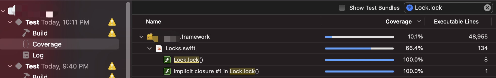

## 问题

随着基础库的能力越来越强大，测试的复杂度也随之升高。我们需要更多不同种类的 case 来保障基础库的质量。举一些常见的例子：

* 有些底层函数只需要单元测试就可以保证质量，有些场景则需要进行交互测试，还有一些布局相关的场景，我们选择基于 [iOSSnapshotTestCase](https://github.com/uber/ios-snapshot-test-case) 这个工具来进行像素比较测试
* 关注逻辑正确性的测试，一般会使用 Debug 模式进行编译，而性能敏感以及一些其他特殊的测试，则需要基于 Release 模式，或者使用更加订制的模式进行编译
* 对于一些分版本实现的逻辑，需要运行在对应版本的设备上进行测试

随着越来越多的 case 积累，带来的挑战是编译时间和测试执行时间的双重膨胀。考虑到各种编译模式的总编译时间，以及所有 case 的执行时间，目前已经超过了 30 分钟，长期来看可能会超过一小时，显然难以接受。

好在公司内自研了一套 Mac 集群系统，同一时刻可以把任务分派到不同的机器上，通过多台机器并行编译和测试，减少总的 CI 时间。这是一种相对长期合理的、能够从根源上解决 CI 耗时过长的技术方案。

但这种方案也会带来一个问题：类比 K8S 和 Docker 的概念，每一次执行 CI 脚本时，都会由调度管理平台从集团内部所有的 Mac 机器中指派一台最合适的机器，创建出一个虚拟环境用来执行 CI 脚本。同时为了避免各个任务之间的影响，CI 脚本的执行环境是高度隔离的，它对宿主物理机一无所知。由于每次编译的路径各不相同，因此在不同任务中分别运行一部分测试得到的覆盖率，无法进行合并。我们可能会得到如下数据：

这里同一份 `lock` 文件由于编译路径不同，导致在覆盖率工具的视角中，它其实是三个 ID 不同，但恰好内容相同的文件。而我们的目标是告诉覆盖率工具，它们其实是同一个文件，每一行的覆盖率情况都需要被精确的求和。

## 覆盖率统计原理

### swift 覆盖率

首先最简单的结论是，简单的覆盖率相加肯定不可信，因为会有重复执行的部分。

对于在 Xcode 中可以看到的覆盖率数据，会保存在运行测试后的 `.xcresult` 文件中。可以用 `xcrun xccov view --report path/to/xx.xcresult` 命令去解析，但只能得到覆盖率百分比，依然没有更加细致的数据可供合并。而且 Xcode 的数据格式相对来说更加黑盒，比如目前还没有发现比较好的工具，能够把这个覆盖率信息以网页形式进行展示。

因此笔者把思路转向更加原始的数据，即 Swift 自身的覆盖率计算方式。在 Swift 发展的早期，业内曾经有 [SwiftCov](https://github.com/realm/SwiftCov) 这样的工具可以用来生成覆盖率数据，但是随着 Swift2 原生支持了覆盖率信息，目前 Swift 的覆盖率事实上有且只有一套官方的方案，是基于 LLVM 实现的。基于官方方案的另一个好处是，配套工具相对比较成熟，比如可以生成网页，能够精确展示每行代码的执行情况，并且能够支持范型特化等多种复杂场景的统计。

具体的资料可以参考这篇官方文档：[Source-based Code Coverage](https://clang.llvm.org/docs/SourceBasedCodeCoverage.html)，这里笔者会把生成覆盖率的流程拆解为三个阶段，分别介绍每个阶段都做了哪些事情，以及覆盖率数据最终是如何被生成的。

### MachO 文件编译

启用测试覆盖率的本质是增加了两个编译参数：`-profile-generate` 和 `-profile-coverage-mapping`。这两个参数也可以手动添加到 `Swift Compiler -> Custom Flags -> Other Swift Flags` 选项中。

关于这两个参数的具体解释，可以用 `swiftc --help` 命令查看

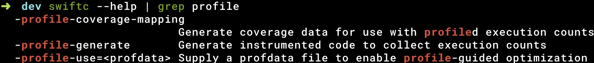

这里的解释可能还是不够直观，所以可以看下编译出来的 MachO 文件，有什么特殊之处。首先可以看到多了一些 Section，这些 Section 都是用来进行覆盖率统计的。

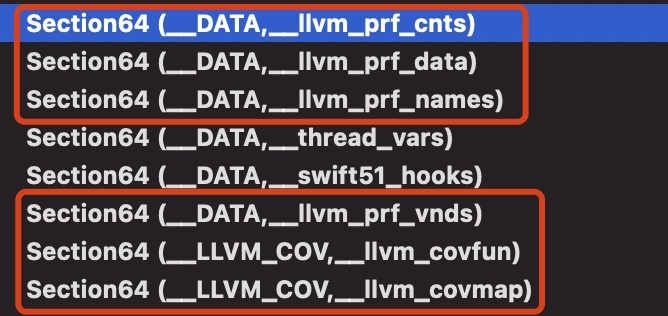

还是以之前的 `lock` 函数为例，看一下它的汇编，可以看到插入了下面这段打点逻辑。

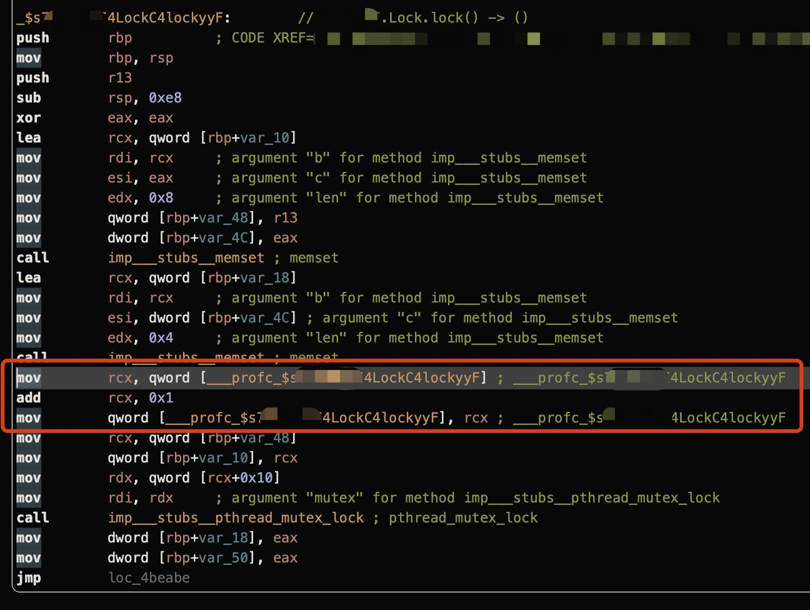

可以把这个 `___profc_xxx` 符号理解为打点的计数器，具体的地址就保存在 MachO 文件的 `__DATA` 段，`__llvm_prf_cnts` 节中。在程序刚启动时，所有的计数器的值都是零，每当对应的代码被执行到一次，计数器的值就加一。

现在我们就比较容易理解前面说的两个编译参数的含义了，MachO 文件中多出来的代码，由 `-profile-generate` 参数生成。而多出来的一些 `__LLVM_COV` 段则是由 `-profile-coverage-mapping` 参数生成。之所以要做这样的拆分，笔者认为可能的原因是，插桩信息除了可以用于覆盖率分析以外，还可以用来进行 PGO 优化，参考：[使用 Profile Guided Optimization 提升 Application 的性能](https://zhuanlan.zhihu.com/p/48236683)。

值得一提的是，插桩的数量和代码行数、函数数量都不是一对一的关系。事实上每一个桩都会和一个 Basic Block（BB）对应。一个 Basic Block 是指一段 “只有一个入口和一个出口，中间再无其他的 jump/return/if 等流程控制语句” 的代码。一个 Basic Block 对应一个桩的好处是，不需要为每行都插桩，从而大大减少了可执行文件的大小并且提高了执行的速度。同时还能够精确分析到所有代码的执行情况。

> 注意：BB 和行并没有明确的包含关系，比如一行三目运算符其实会包含两个 BB。一个 BB 只表示一个开始的行号和列号，以及一个结束的行号和列号。

### profraw 与 profdata 生成

当插了桩的可执行文件结束运行后，LLVM 会提取 `__DATA/__llvm_prf_cnts` 这一节中的执行数据，并且在 DerivedData 目录的 `Build/ProfileData/` 目录下生成一个 `profraw` 和 `profdata` 文件。

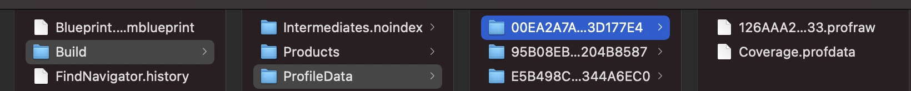

可以把 `profraw` 理解为抽取出来的原始数据，完全是二进制的，没有可读性。而 `profdata` 是经过汇总处理的结构化数据，虽然还是二进制的，但其中已经可以看到一些计数器信息了。可以使用下面的命令，把 `profraw` 文件转换成 `profdata` 文件。

可以使用 `llvm-profdata show` 命令来查看 `profdata` 的内容：

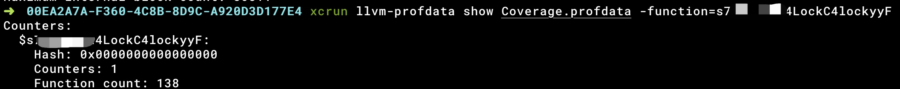

如上图所示，可以看到这个 Basic Block 被执行了 138 次。

实际上，`.profdata` 可以简单理解为上述结构的数组，它本质上记录了每个埋点（Basic Block）的执行次数。

完整用法可以查看官方文档：[llvm-profdata - Profile data tool](https://llvm.org/docs/CommandGuide/llvm-profdata.html)

### 覆盖率导出

#### 流程和效果

最终得到覆盖率数据，需要三个文件：

* 埋点计数结果：`.profdata` 
* MachO 可执行文件
* 源码目录

然后使用 `llvm-cov` 命令生成 HTML 格式的覆盖率报告：

这样就可以生成覆盖率报告：

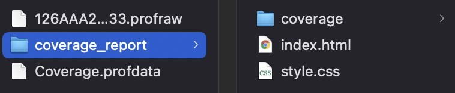

其中 `index.html` 是所有文件的覆盖率数据汇总，而每个文件精确到行级别的覆盖率信息，则保存在 `coverage` 文件夹中，每个文件对应一个 HTML。由于源码保密，这里以 Chromium 的覆盖率信息为例，演示下通过 `llvm` 官方工具生成的结果：

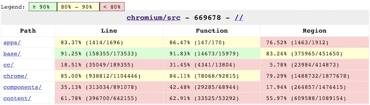

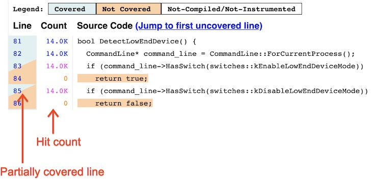

#### 导出原理

整个流程跟踪下来，最关键的一步在于理解 `llvm-cov` 命令是如何生成覆盖率报告的。

首先我们知道 `profdata` 文件只有计数器的调用次数，而且覆盖率报告中的源码，一定是根据我们传入的源码路径获取的。因此计数器信息之所以能够和源码关联起来，靠的一定是 MachO 文件。通过查阅资料，笔者的猜想在 LLVM 的文档：[LLVM Code Coverage Mapping Format](https://llvm.org/docs/CoverageMappingFormat.html#high-level-overview) 中得到了印证：

> LLVM’s code coverage mapping format is designed to be a self contained data format that can be **embedded into the LLVM IR and into object files**. It’s described in this document as a mapping format because its goal is to store the data that is required for a code coverage tool to **map between the specific source ranges in a file and the execution counts obtained after running the instrumented version of the program.**

> The mapping data is used in two places in the code coverage process:

> 1. When clang compiles a source file with -fcoverage-mapping, it **generates the mapping information that describes the mapping between the source ranges and the profiling instrumentation counters**. This information gets embedded into the LLVM IR and conveniently ends up in the final executable file when the program is linked.
> 2. It is also used by llvm-cov - **the mapping information is extracted from an object file and is used to associate the execution counts (the values of the profile instrumentation counters), and the source ranges in a file**. After that, the tool is able to generate various code coverage reports for the program.

这一段清楚的解释了，MachO 文件的作用是提供了一种映射关系，它的一边关联了插桩计数器，另一边关联了这个计数器对应的源码范围。为了定位一段代码，又需要五个参数：源码路径、起始行号和列号，结束行号和列号。这些信息在编译 MachO 文件时被写入到 `__LLVM_COV` 段中，再由 `llvm-cov` 工具负责解析。

经过观察，笔者发现源码的路径信息，可以在 `__llvm_comap` 这一节中直接看到，而源码起止范围的信息，也是就是 Basic Block，可能由于存储方式经过压缩，并不能直观的阅读，但这不影响对流程的理解。

### 原理总结

总结来说，Swift 代码覆盖率的计算流程，大致分为两大流程，如下图所示：

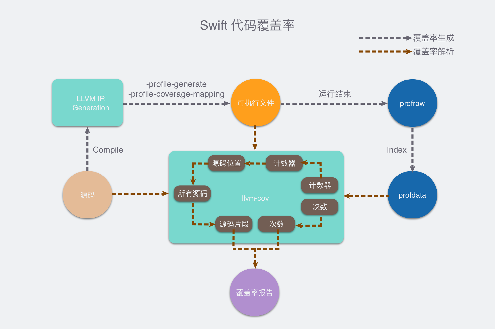

第一条流程是编译执行流程。首先使用 `-profile-generate` 和 `-profile-coverage-mapping` 参数，将源码编译为可执行文件。

编译产物中会对代码进行插桩。执行到特定位置的代码，就会增加计数器的值。同时会把计数器和对应的 Basic Block 的源码位置信息，存储在编译产物的 `__LLVM_COV` 段中。

编译产物运行过程中，随着代码的执行，计数器的值会不断增加，并且写入 `__DATA 段`。结束运行后生成 `.profraw` 文件，再整合处理为 `.profdata` 文件，文件中记录了每个计数器，以及它的调用次数。

另一条流程是覆盖率生成的流程。需要用到之前流程中的可执行文件和 `profdata`，并且结合源码生成覆盖率报告。具体原理是：遍历 `profdata` 中的每一个计数器，先根据可执行文件中存储的映射关系，找到这个计数器所对应统计的那一段源码，从而生成行级别的覆盖率信息。

## 解决方案

到目前为止，我们已经搞清楚了 Swift 代码覆盖率的计算原理。当下的实际工程情况是，我们有多个 `xctestplan`，分别运行在不同的 CI 机器上，因此会生成多份不同的 `profdata` 文件和多个相同的可执行文件。

因此整体的思路是，基于 `llvm-profdata merge` 命令，对多份 `profdata` 文件进行合并，然后任意选择一个可执行文件，再结合源码，生成覆盖率报告。

之所以 `profdata` 可以被合并，甚至是简单的相加，原因就在于它统计的是 Basic Block 的执行次数。Basic Block 对应着程序最小粒度的流程控制。同样的源码会编译出相同的 Basic Block，同一个 Basic Block 中的代码，执行次数也一定相同。

### 路径映射

首先要解决的，是编译路径随机的问题。假设我们在编译时的工作路径是 A，而在生成覆盖率报告时的工作路径是 B。这会导致可执行文件的 `__LLVM_COV` 段中，会存储一个路径 A，而在生成覆盖率报告时我们拿到的源码实际位于物理路径 B，因此无法正确关联到源码。具体表现是生成的覆盖率信息是空的。

这里笔者采用了苹果在 Swift 5.3 中新增的一个编译参数：`-coverage-prefix-map`，具体介绍可以参考[这个 MR](https://github.com/apple/swift/pull/32416)。简而言之，这个参数的作用是把 `__LLVM_COV` 段中的源码路径，从当前实际的路径，映射成任意虚拟的路径。然后再在 `llvm-cov` 命令中把这个虚拟路径还原为真实路径。

举个例子，我们可以在 `Other Swift Flags` 中增加一个编译参数：`-coverage-prefix-map $PWD=/ROOT`，这样我们在 `__LLVM_COV` 段中就会看到源码都位于 `/ROOT` 目录而不是 A 目录下。然后在生成覆盖率报告时，用 `llvm-cov -path-equivalence=/ROOT,B` 告诉 LLVM 这里的 `/ROOT` 是个虚拟路径，实际路径位于 B。

这样通过 swiftc 的 `-coverage-prefix-map` 参数和 llvm-cov 的 `-path-equivalence` 参数，我们就实现了任意编译路径 A 到实际解析路径 B 的转换。

理论上，如果我们在生成覆盖率报告时，能够直接拿到路径 A，也可以只用 `llvm-cov -path-equivalence=A,B` 来达到目的。获取路径 A 的方式有很多，比如解析 `profdata` 或者可执行文件，亦或者通过 CI 系统进行参数传递。由于时间关系 ~~（懒）~~，笔者没有进行尝试。

### profdata 处理

解决了路径映射的问题后，其实就已经跑通了流程。具体的做法是：

1. 把 N 个 `xctestplan` 分配到 N 台机器上，各自运行一个任务
2. 把这 N 个任务各自的 `profdata` 作为产物，提供给下游的覆盖率分析任务，第一个任务还要提供一个可执行文件
3. 在覆盖率分析任务中：
    1. 首先以同样的 commit-id 下载代码，同时下载前面 N 个任务的 `profdata` 和第一个任务的可执行文件
    2. 使用 `llvm-profdata data merge A.profdata B.profdata ... -output merge.profdata` 命令，将所有 `profdata` 合并成同一个
    3. 使用 `merged.profdata` 和下载下来的源码和可执行文件，配合 `-path-equivalence` 参数，生成覆盖率报告。

经过测试，汇总后的覆盖率确实高于任何一次单独运行的覆盖率，工作表现良好。

但是经过一段时间的运行后，根据组内同学的反馈，笔者还是发现了一个不符合预期的 case。一个函数的某个部分，在明确添加了测试 case 后，覆盖率依然为零。

经过排查，发现问题出现在插桩计数器的名字上。对于一些简单的函数，它的计数器名字可以简单理解为函数名的 `mangle` 结果，与实际路径无关，因此不管在什么机器上编译，计数器的名字都不会变。这样在合并 `profdata` 时，就可以简单的把这个 Basic Block 在每次运行时的计数相加，从而得到最终计数结果。

但对于一些闭包，甚至是隐式的闭包，它的计数器名字包含了路径信息，目前还不清楚是 Feature 还是 Bug，比如还是以 `lock()` 函数为例，它的某一部分实现如下图所示：

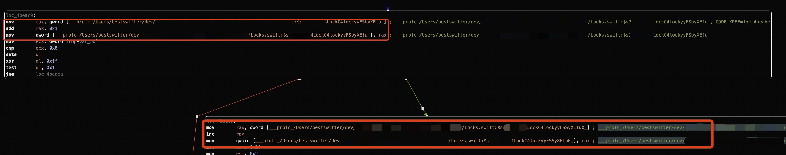

这个 if 判断对应的两个 Basic Block 的计数器，名字就携带了路径信息。这样在合并 `profdata` 时会被判断为不同的计数器，合并后的 `profdata` 会包含如下数据：

而预期结果是：`counter_name = /path/A/counter count = 6`

好在经过调研，发现这些计数器的名字除了路径不同外，其它都是一样的。由于我们使用的可执行文件，对应的是第一个 `profdata`，因此只需要在其它的 `profdata` 中，把计数器名字中的路径都修改成和第一个 `profdata` 中的路径即可。

由于 LLVM 并没有提供修改 `profdata` 的工具，所以最初的做法是使用 `sed` 直接修改二进制文件。经过尝试发现，虽然可以成功修改路径，但是只要路径长度发生了变化，就会破坏 `profdata` 文件的格式，导致无法读取。这可能是由于 `profdata` 内部特定的布局结构导致的。而 CI 环境的工作目录随机，并不保证长度一致，因此这种解决方案宣告失败。

最终的解决方案是从上游数据入手，由于 `profdata` 是由 `profraw` 文件生成而来，两者数据完全等价。因此把目光转向 `profraw` 文件的处理。通过[阅读文档](https://llvm.org/docs/CommandGuide/llvm-profdata.html#cmdoption-llvm-profdata-merge-text)，发现 `llvm-profdata merge` 命令支持选择输出结果的格式，除了默认二进制的格式外，还支持 `-text` 参数，生成纯文本格式的 `profdata`。此时再修改路径，就不会破坏 `profdata` 的格式了。

经过验证，文本格式的 `profdata` 的 merge 效果同样符合预期，同一个计数器的调用次数被正确的相加，最终生成了正确的覆盖率报告。

## 方案总结

本文通过分析 Swift 代码覆盖率的实现原理，支持了分布式编译和测试 Swift 代码后，合并展示覆盖率，从根本上控制了 CI 的耗时，为后续更复杂场景下的质量保障提供了可行性。

具体的做法是：

* 将每个测试结果的 `profraw` 文件解析为文本格式的 `profdata` 并且统一路径
* 合并多个 `profdata` 得到真实的覆盖率数据
* 使用 `llvm-cov -path-equivalence` 命令完成源码路径的映射

随着这套方案的落地，我们拆分了五个测试，整体 CI 耗时从原先的 30 分钟以上下降到 10 分钟左右。同时在 Swift 覆盖率方面有了一定的技术积累和储备，后续可以进行覆盖率 Diff 分析和卡口等更加长期的迭代。

## 广告时间

抖音基础技术在北京、上海、深圳、杭州四地持续招聘，欢迎加我微信 `sevenkplus` 咨询，免费提供工作介绍、团队介绍、简历修改、进度跟踪、面试辅导等各种服务。或者扫码投递简历

## 参考文档

1. [Source-based Code Coverage](https://clang.llvm.org/docs/SourceBasedCodeCoverage.html)
2. [🚧Source-based Code Coverage for Swift Step by Step](https://nycode-jn.medium.com/source-based-code-coverage-for-swift-step-by-step-3df3c44c28d9)
3. [使用 Profile Guided Optimization 提升 Application 的性能](https://zhuanlan.zhihu.com/p/48236683)
4. [llvm-profdata - Profile data tool](https://llvm.org/docs/CommandGuide/llvm-profdata.html)
5. [llvm-cov - emit coverage information](https://llvm.org/docs/CommandGuide/llvm-cov.html)
6. [🚧Code Coverage in Chromium](https://chromium.googlesource.com/chromium/src/+/HEAD/docs/testing/code_coverage.md)
7. [LLVM Code Coverage Mapping Format](https://llvm.org/docs/CoverageMappingFormat.html#high-level-overview)
8. [Add path remapping with -coverage-prefix-map to coverage data #32416](https://github.com/apple/swift/pull/32416)